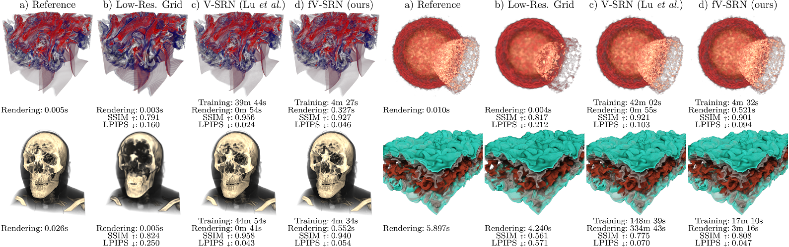

# Fast Neural Representations for Direct Volume Rendering

[Sebastian Weiss](https://github.com/shamanDevel), Philipp Hermüller, Rüdiger Westermann

This repository contains the code and settings to reproduce all figures (and more) from the paper.
https://arxiv.org/abs/2112.01579

### Jump to
[How to train a new network](#how-to-train)

[How to reproduce the figures](#how-to-reproduce-the-figures)

### Video

## Requirements

 - NVIDIA GPU with RTX, e.g. RTX20xx or RTX30xx (we use an RTX2070)
 - CUDA 11
 - OpenGL with GLFW and GLM
 - Python 3.8 or higher, see `applications/env.txt` for the required packages

Tested systems:

- Windows 10, Visual Studio 2019, CUDA 11.1, Python 3.9, PyTorch 1.9
- Ubuntu 20.04, gcc 9.3.0, CUDA 11.1, Python 3.8, PyTorch 1.8

## Installation / Project structure

The project consists of a C++/CUDA part that has to be compiled first:

- `renderer`: the renderer static library, see below for [noteworthy files](#noteworthy-files). Files ending in `.cuh` and `.cu` are CUDA kernel files.
- `bindings`: entry point to the Python bindings, after compilation leads to a python extension module `pyrenderer`, placed in `bin`
- `gui`: the interactive GUI to design the config files, explore the reference datasets and the trained networks. Requires OpenGL

For compilation, we recommend CMake. For running on a headless server, specifiy `-DRENDERER_BUILD_OPENGL_SUPPORT=Off -DRENDERER_BUILD_GUI=Off`.
Alternatively, `compile-library-server.sh` is provided for compilation with the built-in extension compiler of PyTorch. We use this for compilation on our headless GPU server, as it simplifies potential wrong dependencies to different CUDA, Python or PyTorch versions with different virtualenvs or conda environments.

After compiling the C++ library, the network training and evaluation is performed in Python. The python files are all found in `applications`:

- `applications/volumes` the volumes used in the ablation studies
- `applicatiosn/config-files` the config files
- `applications/common`: common utilities, especially `utils.py` for loading the `pyrenderer` library and other helpers
- `applications/losses`: the loss functions, including SSIM and LPIPS
- `applications/volnet`: the main network code for training in inference, see below.

### Common compilation issues

- Wrong python version used: make sure to run cmake in the same console where the correct python version is selected via conda or virtualenv. This must be done on a clean `build`-folder, as the paths to the python libraries are cached in the `build/CMakeCache.txt`-file.
- Wrong pytorch version used or no pytorch found: Sometimes, the automatic query of the PyTorch installation folder from the current Python installation failes. You can manually specify the path to PyTorch by passing `-DTORCH_PATH=...` as argument to CMake
- Libraries `torch_cuda_cpp` and `torch_cuda_cu` are not found. Some PyTorch installations don't split the CUDA-kernels into different libraries, but have a single monolitic library `torch_cuda`. In that case, simply remove `torch_cuda_cpp` and `torch_cuda_cu` from https://github.com/shamanDevel/fV-SRN/blob/master/CMakeLists.txt#L125. If you know a way to query if PyTorch was built with the CUDA-kernels split into multiple libraries, please write me or open an issue. Thanks

## Noteworthy Files

Here we list and explain noteworthy files that contain important aspects of the presented method

On the side of the C++/CUDA library in `renderer/` are the following files important. Note that for the various modules, multiple implementations exists, e.g. for the TF. Therefore, the CUDA-kernels are assembled on-demand using NVRTC runtime compilation.

- 
  Image evaluators (`iimage_evaluator.h`), the entry point to the renderer. Only one implementation:
  
  - `image_evaluator_simple.h`,  `renderer_image_evaluator_simple.cuh`: Contains the loop over the pixels and generates the rays -- possibly multisampled for Monte Carlo -- from the camera
  
- Ray evaluators (`iray_evaluation.h`), called per ray and returns the colors. They call the volume implementation to fetch the density

  - `ray_evaluation_stepping.h`, `renderer_ray_evaluation_stepping_iso.cuh`, `renderer_ray_evaluation_stepping_dvr.cuh`: constant stepping for isosurfaces and DVR.
  - `ray_evaluation_monte_carlo.h` Monte Carlo path tracing with multiple bounces, delta tracking and various phase functions

- Volume interpolations (`volume_interpolation.h`). On the CUDA-side, implementations provide a functor that evaluates a position and returns the density or color at that point

  - Grid interpolation (`volume_interpolation_grid.h`), trilinear interpolation into a voxel grid stored in `volume.h`.
  - Scene Reconstruction Networks (`volume_interpolation_network.h`). The SRNs as presented in the paper. See the header for the binary format of the `.volnet` file.
    The proposed **tensor core implementation** (Sec. 4.1) can be found in `renderer_volume_tensorcores.cuh`

On the python side in `applications/volnet/`, the following files are important:

- `train_volnet`: the entry point for training
- `inference.py`: the entry point for inference, used in the scripts for evaluation. Also converts trained models into the binary format for the GUI
- `network.py`: The SRN network specification
- `input_data.py`: The loader of the input grids, possibly time-dependent
- `training_data.py`: world- and screen-space data loaders, contains routines for importance sampling / adaptive resampling. The rejection sampling is implemented in CUDA for performance and called from here
- `raytracing.py`: Differentiable raytracing in PyTorch, including the memory optimization from Weiss&Westermann 2021, [DiffDVR](https://github.com/shamanDevel/DiffDVR)

## How to train

The training is launched via `applications/volnet/train_volnet.py`. Have a look at `python train_volnet.py --help` for the available command line parameters.

A typical invocation looks like this (this is how fV-SRN with Ejecta from Fig. 1 was trained)

    python volnet/train_volnet.py
       config-files/ejecta70-v6-dvr.json
       --train:mode world  # instead of 'screen', Sec. 5.4
       --train:samples 256**3
       --train:sampler_importance 0.01   # importance sampling based on the density, optional, see Section 5.3
       --train:batchsize 64*64*128
       --rebuild_dataset 51   # adaptive resampling after 51 epochs, see Section 5.3
       --val:copy_and_split  # for validation, use 20% of training samples
       --outputmode density:direct  # instead of e.g. 'color', Sec. 5.3
       --lossmode density
       --layers 32:32:32  # number of hidden feature layers -> that number + 1 for the number of linear layers / weight matrices.
       --activation SnakeAlt:2
       --fouriercount 14
       --fourierstd -1  # -1 indicates NeRF-construction, positive value indicate sigma for random Fourier Features, see Sec. 5.5
       --volumetric_features_resolution 32  # the grid specification, see Sec. 5.2
       --volumetric_features_channels 16
       -l1 1  #use L1-loss with weight 1
       -lr 0.01
       --lr_step 100  #lr reduction after 100 epochs, default lr is used 
       -i 200  # number of epochs
       --save_frequency 20  # checkpoints + test visualization

After training, the resulting `.hdf5` file contains the network weights + latent grid and can be compiled to our binary format via `inference.py`. The resulting `.volnet` file can the be loaded in the GUI.

## How to reproduce the figures

Each figure is associated with a respective script in `applications/volnet`. Those scripts include the training of the networks, evaluation, and plot generation. They have to be launched with the current path pointing to `applications/`. Note that some of those scripts take multiple hours due to the network training.

- Figure 1, teaser: `applications/volnet/eval_CompressionTeaser.py`
- Table 1, possible architectures: `applications/volnet/collect_possible_layers.py`
- Section 4.2, change to performance due to grid compression: `applications/volnet/eval_VolumetricFeatures_GridEncoding`
- Figure 3, performance of the networks:  `applications/volnet/eval_NetworkConfigsGrid.py`
- Section 5, study on the activation functions:  `applications/volnet/eval_ActivationFunctions.py`
- Figure 4+5, latent grid, also includes other datasets:  `applications/volnet/eval_VolumetricFeatures.py`
- Figure 6, density-vs-color:
   `applications/volnet/eval_world_DensityVsColorGrid_NoImportance.py` without initial importance sampling and adaptive resampling (Fig. 6)
  `applications/volnet/eval_world_DensityVsColorGrid.py` , includes initial importance sampling, not shown
  `applications/volnet/eval_world_DensityVsColorGrid_WithResampling.py` , with initial importance sampling and adaptive resampling, improvement reported in Section 5.3
- Table 2, Figure 7, screen-vs-world:  `applications/volnet/eval_ScreenVsWorld_GridNeRF.py`
- Figure 8, Fourier features:  `applications/volnet/eval_Fourier_Grid.py` , includes the datasets not shown in the paper for space reasons
- Figure 9,10, time-dependent fields:
   `applications/volnet/eval_TimeVolumetricFeatures.py`: train on every fifth timestep
   `applications/volnet/eval_TimeVolumetricFeatures2.py`: train on every second timestep
   `applications/volnet/eval_TimeVolumetricFeatures_plotPaper.py`: assembles the plot for Figure 9

The other `eval_*.py` scripts were cut from the paper due to space limitations. They equal the tests above, except that no grid was used and instead the largest possible networks fitting into the TC-architecture
